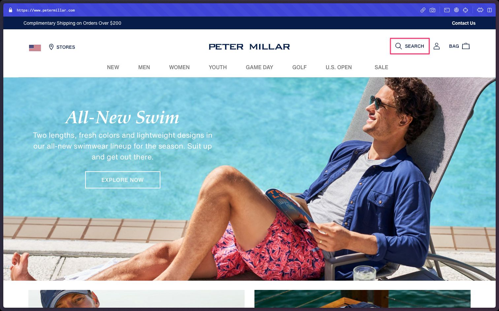
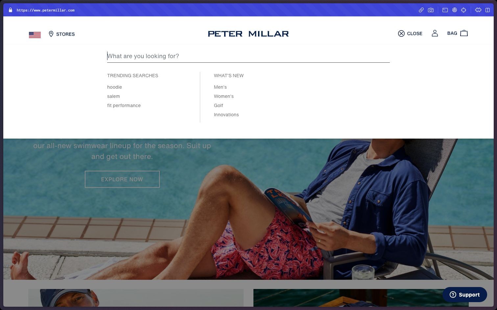
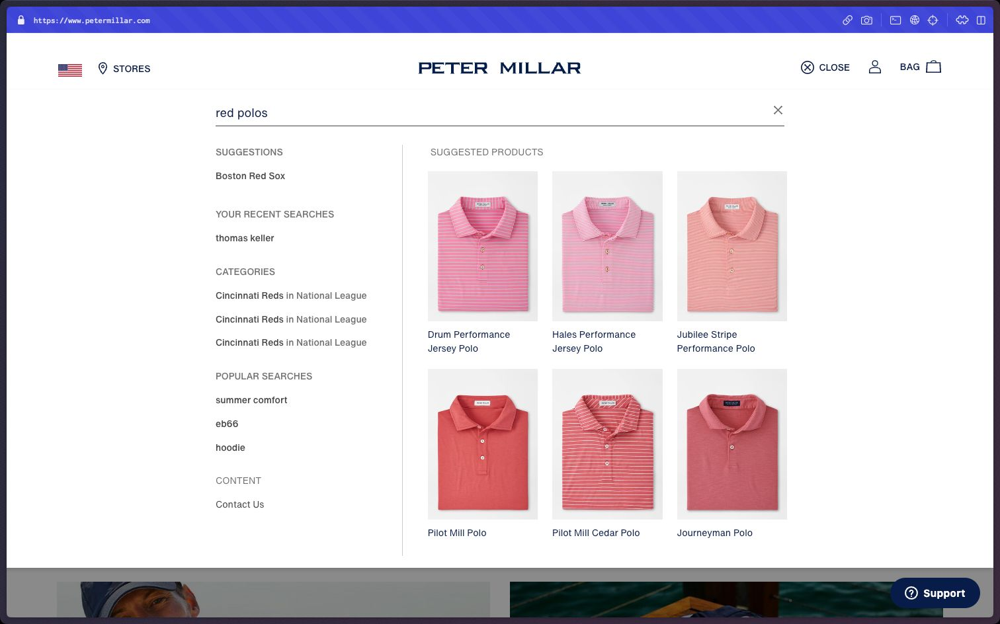

# Peter Millar Jr. UX Developer Practical

This practical exam consists of two parts: a **development** problem and a **design** problem. 

The [Development Problem](#development-problem) requires you to build a web page based on a design file. Your solution should showcase your front-end development skills. 

The [Design Problem](#design-problem) requires you to analyze a particular feature of the Peter Millar site and offer suggestions to improve the UX, through a written response. Your solution should effectively communicate your ideas without relying on visuals.

## Development Problem

For this portion of the practical, you are tasked with developing a web page based on [a design](https://www.figma.com/file/h2z4KJFwaT8h8pqYjL47Aq/UX-Developer-Practical?type=design&node-id=0-1&mode=design). The design is a (fake) marketing page for a particular product, but includes layout elements that are common in our work. Your solution should match the design and work well across various device sizes. The design file includes comps for desktop (1512w) and mobile (390w). You should use your best judgement in adapting the design for screen size ranges that aren't captured in the designs (such as the tablet range). Also refer to the Breakpoint Reference in the [Reference Materials](https://www.figma.com/file/h2z4KJFwaT8h8pqYjL47Aq/UX-Developer-Practical?type=design&node-id=36-498&mode=design) page of the design file. You may use additional breakpoints as needed, to make the design work for different sizes. 

We will review your solution—the code itself, and by viewing the dev server in a browser—and ask questions about it during the follow-up call. 

### Dev Setup

Within the [`dev`](./dev/) directory you will find a project starter, ready for you to start developing. The starter uses [Vite](https://vitejs.dev/), which is a build tool that requires little config. It has already been configured in this project starter.

Some starter CSS is also provided, which includes a few utilities like color and font variables from the design. You can modify the starter code however you'd like. 

For the purposes of this practical, you should not need to learn much about Vite except for a few standout things noted below.

#### Getting Started

When starting your project, don't forget to `cd` into the `dev` folder, and install npm dependencies:
```bash
cd dev
npm i
```
To run the dev server & start developing:
```
npm run dev
```

#### Static Asset URLs (Images, etc.)

Vite handles static assets in it's own way. Any static assets, such as image files, should go in the `src/public/` directory. You should reference them in your markup with a leading `/` and a path relative to the `public` directory.

For example, say you have an image in the `public` dir: `src/public/some.png`. You should reference it in your HTML like so:
```html

```

#### Stylesheets (CSS, SCSS)

The project is already configured to import the `style.scss` file in `main.js`. Importing the stylesheet into the JS entry point is a Vite convention—it is recommended to leave this as is to avoid build/config issues. 

Sass (SCSS) is already configured to work within the project.

### Rules

You should use vanilla HTML and CSS in your solution, meaning that the following are **not allowed** for use:

- Component libraries such as React, Svelte, and Vue
- Templating languages such as Handlebars and EJS
- CSS frameworks such as Bootstrap and Tailwind

You may use JavaScript if you'd like, but there are no parts of the interface that require interactivity.

### Materials

- [Figma Link](https://www.figma.com/file/h2z4KJFwaT8h8pqYjL47Aq/UX-Developer-Practical?type=design&node-id=0%3A1&mode=dev) (design file)
- [Breakpoint Reference](https://www.figma.com/file/h2z4KJFwaT8h8pqYjL47Aq/UX-Developer-Practical?type=design&node-id=36-498&mode=design) (Reference Materials page in Figma file)

## Design Problem

When we are working on a UX problem, discussing and ideating without even putting pen to paper is often how we begin. For this portion of the practical, you are tasked with analyzing a feature, identifying problems that you believe exist within it, and providing a solution to the problem. Your solution should be a written response that identifies the problem(s) you feel is present, and how you would solve it.

The feature you will analyze and provide a solution for is the on-site Search experience on [petermillar.com](https://petermillar.com). You should focus on the Desktop experience. 

The Search experience includes:
- The Search Button in the header
- Search Overlay that shows when the Search Button is clicked
- The UI within the Overlay that shows suggestions based on the current query
- The Search Result Page (SRP) that shows when you hit `Enter` after typing in a query

Assume the following statements are true for Desktop users:
- We have data that suggests that people who start using Search often leave the Search feature without clicking on a product or proceeding to a SRP.
- People who _do_ use Search and end up clicking on a product from the Search flow almost always purchase that product.

### Deliverable

You should include your response in the [`des`](./des/) directory. Your deliverable should be a text document, and can be of the following file types:

- Markdown (.md)
- Word (.docx)
- Pages (.pages)

### Design Reference

Below are screenshots of the current Search feature. We also encourage you to use the feature for yourself on [petermillar.com](https://petermillar.com).


_Search Button_


_Search Overlay (Default)_


_Search Overlay (User Input)_
